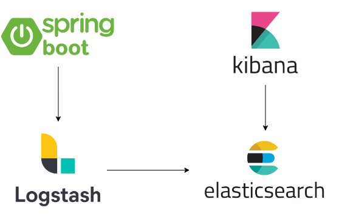
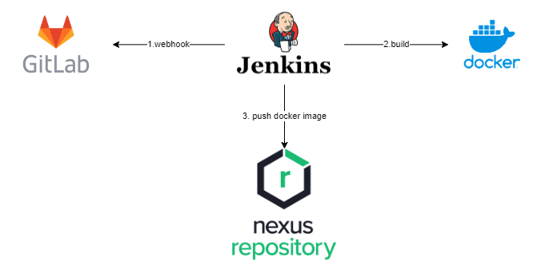

# springboot-3.0.X project templat with JDK-17

### OpenAPI 3.0.1
---
`OpenApiConfig.java` is custom configuration for open api.

```yaml
springdoc:
  packagesToScan: com.mutu.spring
  api-docs.path: /api-docs
  swagger-ui:
    path: /swagger-ui.html
    enabled: true
appInfo:
  name: '@project.name@'
  description: '@project.description@'
  version: '@project.version@'
  license.name: 'Mutu'
  license.url: 'http://mutu.nocontact.com'
```
swaggerui: `http://host:port/context-path/swagger-ui.html`

apidoc/swagger-file: `http://host:port/context-path/api-doc`

### CorsFilter
---

Configuration base `CorsFilter`.

```yaml
cors:
  headers:
    - "X-XSS-Protection: 1"
    - "X-Content-Type-Options: nosniff"
    - "Cache-Control: no-cache, no-store, max-age=0, must-revalidate"
    - "Pragma: no-cache"
    - "Expires: 0"
    - "X-Frame-Options: SAMEORIGIN"
    - "Content-Security-Policy: script-src 'self'"
    - "Vary: Origin"
    - "Access-Control-Allow-Origin: *"
    - "Access-Control-Allow-Credentials: true"
    - "Access-Control-Allow-Methods: GET, POST, PUT, PATCH, DELETE, OPTIONS"
    - "Access-Control-Allow-Headers: Authorization,Access-Control-Allow-Origin,Content-Type,User-Account,sessionID,X-XSS-Protection,X-Content-Type-Options,Cache-Control,Pragma,Expires,X-Frame-Options,Content-Security-Policy"
    - "Access-Control-Expose-Headers: Authorization,Content-Disposition"
```
### Request/Response auto loging
---

Auto logging for all request and response by `CustomRequestBodyAdviceAdapter.java` and `CustomResponseBodyAdviceAdapter`. If you would like to log one or more header entried log process, you can configure as below. `CustomLogInterceptor.java` will collect and put into `ThreadContext`. eg; root-correlation-id, we need pass the id accross over the `microservices`.

```yaml
header-key-list:
  log4jThreadContextList: x-root-correlation-id
```

### Exception handling 
---
Auto exception hadling for Service/Component and DAO layer by using Spring AOP `ExceptionHandlerAspect.java` and `PointCutConfig.java`. If there is no override exception handling, it will throws `BusinessLogicException` and `DAOException` base on process.

### Exception handling for REST API
---

`RestExceptionHandler.java` is handler to handle the global runtime `Exception.java` and custom exception( `BusinessLogicException.java` and `DAOException.java`).

### Log4j2 + ELK
---



Sending the logs `Log4j2` to `elasticsearch` by using log4j `Socket` and `JsonLayout`. `Logstash` will filter and send to `elasticsearch`. Setup `ELK`. eg: [docker compose ELK](https://github.com/deviantony/docker-elk). This example is compatible ELK 7.0.0 and above.

log4j2.xml

```xml
<?xml version="1.0" encoding="UTF-8"?>
<Configuration>
    <Appenders>
        <Console name="Console" target="SYSTEM_OUT">
            <JsonLayout properties="false" stacktraceAsString="true" includeStacktrace="true" eventEol="true" compact="false" objectMessageAsJsonObject="true">
				<KeyValuePair key="x-root-correlation-id" value="$${ctx:x-root-correlation-id}"/>
				<KeyValuePair key="process-name" value="$${ctx:process-name}"/>
				<KeyValuePair key="applicationName" value="springboot-demo"/>
				<KeyValuePair key="timestamp" value="$${date:yyyy-MM-dd HH:mm:ss.SSS}" />
			</JsonLayout>            
        </Console>
		<Socket name="Socket" host="<<SERVER_ADDRESS>>" port="<<SERVER_PORT>>" protocol="TCP" bufferedIO="true" bufferSize="1048576"
			immediateFail="false" immediateFlush="false" connectTimeoutMillis="2000" reconnectionDelayMillis="5000" ignoreExceptions="true"> 		    
			<JsonLayout properties="false" stacktraceAsString="true" includeStacktrace="true" eventEol="true" compact="true" objectMessageAsJsonObject="true">
				<KeyValuePair key="x-root-correlation-id" value="$${ctx:x-root-correlation-id}"/>
				<KeyValuePair key="process-name" value="$${ctx:process-name}"/>
				<KeyValuePair key="applicationName" value="springboot-demo"/>
				<KeyValuePair key="timestamp" value="$${date:yyyy-MM-dd HH:mm:ss.SSS}" />
			</JsonLayout> 			
		</Socket>
    </Appenders>
 
    <Loggers>
        <AsyncLogger name="com.mutu" level="debug" additivity="false">
			<AppenderRef ref="Console" />
			<AppenderRef ref="Socket" />
		</AsyncLogger>
		<AsyncLogger name="org.apache.catalina.core" level="off" additivity="false">
			<AppenderRef ref="Console" />
		</AsyncLogger>		
		<AsyncRoot level="error">
			<AppenderRef ref="Console" />
		</AsyncRoot>    
    </Loggers>
</Configuration>
```
logstash.conf. If you use above example(ELK docker compose), Update port `50000`.

```conf
input {
  tcp {
    port => 4560
	  type => "json"
    codec => json {
      charset => "UTF-8"
    }	
  }
}

filter {
	json {
		source => "message"
		skip_on_invalid_json => true
	}
	if [message][payload]{
		mutate {
		    add_field => { "payload" => "%{[message][payload]}"}
			add_field => { "log" => "%{[message][process]}"}
			remove_field => [ "[message]" ]
		}
	}
	if [message] =~ /.*/ {
		mutate {
			rename => { "message" => "log" }
		}
	}
	mutate {
		remove_field => [ "[loggerFqcn]" ]
	}	
}

output {
  elasticsearch {
    hosts => ["localhost:9200"]
    index => "logstash"
  }
}
```
Note: if you would like to see `log4j` json log without any changes, you can remove filter. 

### CICD

DevOps ref: you need to setup and conifigure Gitlap, Jenkins and Nexus Repo. `jenkins/Dockerfile` & `jenkins/Jenkinsfile`.


